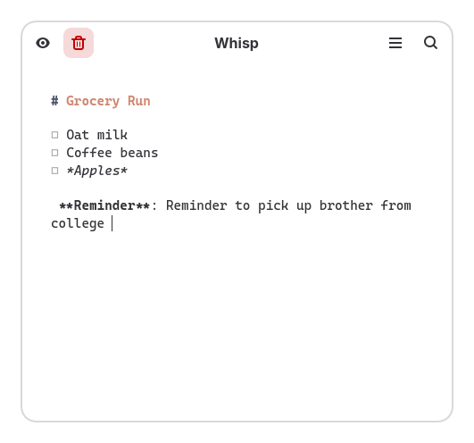

<div align="center">
  

  <h1>Whisp</h1>
  <p><b>The Anti-Note for GNOME. A fluid, gesture-driven scratchpad designed for speed.</b></p>

  <a href="https://flathub.org/apps/io.github.tanaybhomia.Whisp">
    
  </a>
  <br><br>
  
  <a href="#"></a>
  <a href="#"></a>
  <a href="#"></a>
  <br><br>
</div>

<div align="center">
  
</div>


Whisp is a minimalist, lightning-fast note-taking application built strictly for the GNOME desktop environment. It abandons traditional complex file hierarchies in favor of a spatial, swipeable canvas. Inspired by the "anti-note" philosophy, it is designed to act as a seamless desktop scratchpad offering distraction-free Markdown editing while blending perfectly with modern GNOME aesthetics using GTK4 and Libadwaita.

## Core Features

- **Spatial Navigation**: Fluidly swipe between your recent notes using 1:1 touchpad gestures via Adwaita Carousel.
- **WYSIWYG Markdown**: Real-time rendering of Markdown. Toggle WYSIWYG mode to instantly hide Markdown syntax symbols and view clean rich text.
- **Paper Themes**: Native dynamic styling. Choose between Dotted, Grid, or Blank backgrounds to mimic physical engineering paper or scratchpads.
- **Smart Paste**: Copy a URL and press `Ctrl+V` to automatically shrink it via TinyURL in the background, or use `Ctrl+Shift+V` to extract and paste pure plain text, actively stripping all source Markdown formatting.
- **Keyboard-Centric Workflow**: 
  - `Ctrl+N` to instantly create a new note.
  - `Ctrl+B`, `Ctrl+I`, `Ctrl+U` for quick text formatting.
- **Performance Focused**: Maintains a lightweight footprint by rendering only the most recently active notes, ensuring instant startup times.
- **Robust Management**: Search, filter by tags, and safely manage deleted files within a hidden `.trash` directory.

## Installation

Whisp uses the standard Meson build system. It is currently being packaged for Flathub.

### Building from Source

Dependencies required: `python3`, `meson`, `ninja`, `python3-gi`, `libadwaita`, and `gtk4`.

```bash
git clone <your-repo-url>
cd Whisp
meson setup builddir
sudo meson install -C builddir
```

## Architecture

Whisp adheres strictly to the GNOME Human Interface Guidelines (HIG). It leverages `Adw.Carousel` for its swipeable interface and uses a highly optimized `Gtk.TextView` wrapper to instantly parse and decorate Markdown text dynamically.

## License

Whisp is free and open-source software licensed under the **GNU General Public License v3.0** (GPL-3.0). See the [LICENSE](LICENSE) file for more details.
